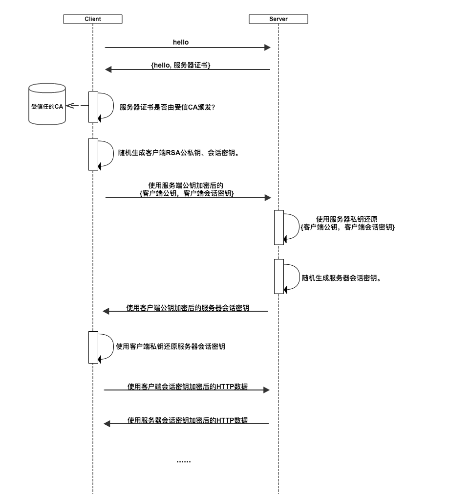
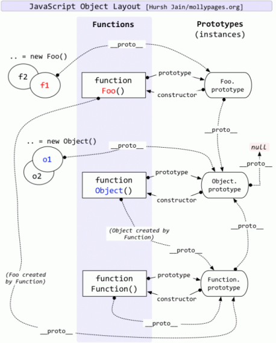
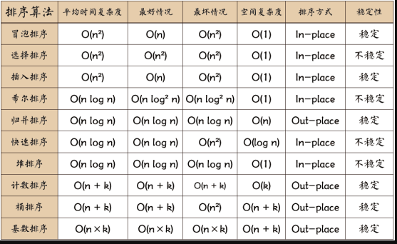

## 基础知识部分

目录

<!-- toc -->

- [No.1 高度已知: 左右各300px, 中间自适应](#no1-%E9%AB%98%E5%BA%A6%E5%B7%B2%E7%9F%A5-%E5%B7%A6%E5%8F%B3%E5%90%84300px-%E4%B8%AD%E9%97%B4%E8%87%AA%E9%80%82%E5%BA%94)
- [No.02 上下居中方案](#no02-%E4%B8%8A%E4%B8%8B%E5%B1%85%E4%B8%AD%E6%96%B9%E6%A1%88)
- [No.03 css盒模型与BFC](#no03-css%E7%9B%92%E6%A8%A1%E5%9E%8B%E4%B8%8Ebfc)
  * [解释边距重叠](#%E8%A7%A3%E9%87%8A%E8%BE%B9%E8%B7%9D%E9%87%8D%E5%8F%A0)
- [No.04 DOM事件类](#no04-dom%E4%BA%8B%E4%BB%B6%E7%B1%BB)
- [No.05 Http协议类](#no05-http%E5%8D%8F%E8%AE%AE%E7%B1%BB)
- [No.06 原型链](#no06-%E5%8E%9F%E5%9E%8B%E9%93%BE)
  * [创建对象的几种方法](#%E5%88%9B%E5%BB%BA%E5%AF%B9%E8%B1%A1%E7%9A%84%E5%87%A0%E7%A7%8D%E6%96%B9%E6%B3%95)
  * [原型、构造函、实例、原型链：](#%E5%8E%9F%E5%9E%8B%E6%9E%84%E9%80%A0%E5%87%BD%E5%AE%9E%E4%BE%8B%E5%8E%9F%E5%9E%8B%E9%93%BE)
- [No.07 面向对象](#no07-%E9%9D%A2%E5%90%91%E5%AF%B9%E8%B1%A1)
  * [类与实例：类的申明、生成实例](#%E7%B1%BB%E4%B8%8E%E5%AE%9E%E4%BE%8B%E7%B1%BB%E7%9A%84%E7%94%B3%E6%98%8E%E7%94%9F%E6%88%90%E5%AE%9E%E4%BE%8B)
  * [继承：](#%E7%BB%A7%E6%89%BF)
- [No.08 通信类](#no08-%E9%80%9A%E4%BF%A1%E7%B1%BB)
  * [同源策略与限制：](#%E5%90%8C%E6%BA%90%E7%AD%96%E7%95%A5%E4%B8%8E%E9%99%90%E5%88%B6)
  * [跨域通信的几种方式：JSONP、Hash、postMessage、WebSocket、CORS(支持跨域通信的ajax)](#%E8%B7%A8%E5%9F%9F%E9%80%9A%E4%BF%A1%E7%9A%84%E5%87%A0%E7%A7%8D%E6%96%B9%E5%BC%8Fjsonphashpostmessagewebsocketcors%E6%94%AF%E6%8C%81%E8%B7%A8%E5%9F%9F%E9%80%9A%E4%BF%A1%E7%9A%84ajax)
- [No.09 安全](#no09-%E5%AE%89%E5%85%A8)
  * [CSRF](#csrf)
  * [XSS：cross-site-scripting 跨域脚本攻击](#xsscross-site-scripting-%E8%B7%A8%E5%9F%9F%E8%84%9A%E6%9C%AC%E6%94%BB%E5%87%BB)
- [No.10 排序算法类](#no10-%E6%8E%92%E5%BA%8F%E7%AE%97%E6%B3%95%E7%B1%BB)
  * [快速排序：](#%E5%BF%AB%E9%80%9F%E6%8E%92%E5%BA%8F)
  * [选择排序：](#%E9%80%89%E6%8B%A9%E6%8E%92%E5%BA%8F)
  * [插入排序：](#%E6%8F%92%E5%85%A5%E6%8E%92%E5%BA%8F)
  * [冒泡法排序：](#%E5%86%92%E6%B3%A1%E6%B3%95%E6%8E%92%E5%BA%8F)
  * [希尔排序](#%E5%B8%8C%E5%B0%94%E6%8E%92%E5%BA%8F)

<!-- tocstop -->

### <p>No.1 高度已知: 左右各300px, 中间自适应</p>

浮动、绝对定位、flexBox（display：flex）、table标签 、网格布局（display:Grid）、display: table-cell;           
延伸：每个解决方案的优缺点，之间的比较；如果去掉高度已知，什么方案不适用了；兼容性，业务中最实用的；              
浮动：需要清除浮动，兼容性比较好；           
绝对定位：快捷、因为已经脱离文档流了，所以子元素都也要脱离文档流，可实用性非常差；           
flex:就是为了以上连个布局的不足的；            
display:table:兼容性非常好，三栏布局，如果某一个高度超出的时候，另外另个也都是会一起增高的；           
网格布局：新技术；           

### No.02 上下居中方案
[垂直和水平居中方案](/books/专题知识库/05、基础知识点专题/other/04、水平和垂直方案/README.md)

### No.03 css盒模型与BFC

**标准和模型+IE盒模型：**        
区别：标准模型的宽高是不计算padding和border的，IE是需要计算的      
css如何设置这两种模型：       
默认是： `box-sizing:content-box;box-sizing:border-box;`    
JS如何设置获取盒模型对应的宽高：       

```javascript
dom.style.width/height;     
dom.currentStyle.width/height;      
window.getComputedStyle(dom).width/height;
```      

#### 解释边距重叠
BFC边距重叠的解决方案                         
[CSS理解：BFC和边距重叠](https://blog.csdn.net/itseven7/article/details/79009215)                               

**BFC基本概念**
Block Formatting Context，中文直译为块级格式上下文。
BFC就是一种布局方式，在这种布局方式下，盒子们自所在的containing block顶部一个接一个垂直排列，水平方向上撑满整个宽度（除非内部盒子自己建立了新的BFC）。
两个相邻的BFC之间的距离由margin决定。在同一个BFC内部，两个垂直方向相邻的块级元素的margin会发生“塌陷”。

文档这里也间接指出了垂直相邻盒子margin合并的解决办法：就是给这两个盒子也创建BFC。

通俗一点，可以把BFC理解为一个封闭的大箱子，箱子内部的元素无论如何翻江倒海，都不会影响到外部。

**如何创建BFC**:
```
float属性不为none
overflow不为visible(可以是hidden、scroll、auto)
position为absolute或fixed
display为inline-block、table-cell、table-caption
```

**BFC的作用**                          
1、清除内部浮动                                    

2、垂直margin合并                                    
在CSS当中，相邻的两个盒子的外边距可以结合成一个单独的外边距。这种合并外边距的方式被称为折叠，并且因而所结合成的外边距称为折叠外边距。折叠的结果：                              
两个相邻的外边距都是正数时，折叠结果是它们两者之间较大的值。                              
两个相邻的外边距都是负数时，折叠结果是两者绝对值的较大值。                               
两个外边距一正一负时，折叠结果是两者的相加的和。这个同样可以利用BFC解决。关于原理在前文已经讲过了。                             

3、创建自适应两栏布局                                     
在很多网站中，我们常看到这样的一种结构，左图片+右文字的两栏结构。                                       
显然，这是文字受到了图片浮动的影响。当然，如果你想做文本绕排的效果，浮动是不二之选。
不过在这里，这显然不是我们想要的。此时我们可以为P元素的内容建立一个BFC，让其内容消除对外界浮动元素的影响。给文字加上overflow:hidden                             

**如何要求容器在宽度自由很缩的情况下，A/B/C的宽度始终是1:1:1，如何实现，写出两种方法。**

flex布局：                     
```css
.div1 {
  width: 100%;
  height: 400px;
  border: 1px solid #888;
  flex-direction: row;
  /**主要代码*/
  display: flex;
  /*     align-items: center; */
  /*     justify-content: center; */
}

.div {
  /*   position:absolute; */
  /*     width:500px; */
  flex-grow: 1;
  border: 1px solid #888;
}
```

百分数布局:inline-block元素间间隙产生及去除详解:             
```html
<style>
.div1 {
  width: 100%;
  height: 400px;
  background-color: red;
}
.div2{
  margin-left: 5%;
}
.div {
  width:30%;
  display:inline-block;
  background-color:#888;
}
</style>

<div class="div1">
  <div class="div2 div">
    div2
  </div><div class="div3 div">
    div3
  </div><div class="div4 div">
    div4
  </div>
</div>
```


### No.04 DOM事件类     
DOM事件级别、DOM事件模型、DOM事件流、DOM事件捕获的具体流程、Event对象的常见应用、自动以事件

**事件级别:**                       
DOM0:element.onclick=function(){};    // 签内写onclick事件              
DOM2:elemeng.addEventListener("click",function(){},false);// 二是在JS写onlicke=function（）{}函数;  第三个指定捕获或者冒泡;  为false表示在冒泡阶段调用                       
DOM3:elemeng.addEventListener("keyup",function(){},false);// 定义了自定义事件; 第三个指定捕获或者冒泡                                 

1级DOM--(为什么没有1级DOM):                    
DOM级别1于1998年10月1日成为W3C推荐标准。1级DOM标准中并没有定义事件相关的内容，所以没有所谓的1级DOM事件模型。
在2级DOM中除了定义了一些DOM相关的操作之外还定义了一个事件模型 ，这个标准下的事件模型就是我们所说的2级DOM事件模型。 


**事件模型：** 捕获（从上到下）、冒泡（从下到上）；

**事件流：** 用户和浏览器做交互的过程中，事件的传递，比如点击左键，怎么传递到页面上的。
捕获->目标阶段->冒泡

**DOM事件具体流程：**  
window->document->html->body->.....普通html一步一步下传...->目标元素

**Event对象：**  
event.keyCode;  
event.preventDefault();//阻止默认时间     
event.stopPropatation();//阻止冒泡      
event.stopImmediatePropagation();//处理事件响应优先级        
event.currentTarget();//当前绑定的事件     
event.target();//获取当前点击元素对象     

**自定义事件：**
```javascript
var eve=new Event('custome');
ev.addEventListener('custome',function(){//ev就是一个简单的元素对象
console.log('custome');
});
ev.dispatchEvent(eve);//触发事件

//需要制定参数的自定义事件    CustomeEvent
var eve = new CustomeEvent('custome',obj);
```

### No.05 Http协议类      
**特点：** 简单快速，灵活、无连接、无状态   
每一个资源对应一个URI，请求只要输入资源地址uri就可以了；     
在每一个http头部协议中都有一个数据类型，通过一个http协议就可以完成不同类型数据的传输；     
链接一次就会断开；       
每一次链接不会记住链接状态的，服务器不区分两次链接的身份；       

**http报文组成部分，建立在 TCP 之上的:**             
请求报文：请求行、请求头、空行、请求体     
请求行：HTTP请求方法、页面地址、协议版本等         
请求头：key,value值，告诉服务端我要什么内容、要什么数据类型                      
空行：分割请求头和请求体的，遇到空行，服务器就知道，请求头结束了，接下来是请求体了           
请求体：就是给服务端的一些入参数据；          
我所了解的请求体有两种格式，Content-Type: application/x-www-form-urlencoded  和  payload  和 json             

**响应报文：** 状态行、响应头、空行、响应体     
状态行：协议版本  状态码   状态      
其他的一样的      

**常见请求头数据和相应头数据（以github某请求为例子）**：                      
Request Headers
```
Accept: */*                         // 告诉服务器，客户机支持的数据类型
Accept-Encoding: gzip, deflate, br  // 告诉服务器，客户机支持的数据压缩格式
Accept-Language: zh-CN,zh;q=0.9     // 编码格式
Connection: keep-alive              // 是否支持场链接
Content-Length: 12308               // 获取文件的总大小
Content-Type: application/json      // 返回数据格式
Host: api.github.com
Origin: https://github.com
Referer: https://github.com/yanlele/node-index/blob/master/book/05%E3%80%81%E5%9F%BA%E7%A1%80%E7%9F%A5%E8%AF%86%E7%82%B9%E4%B8%93%E9%A2%98/01_01%E3%80%81%E5%9F%BA%E7%A1%80%E7%9F%A5%E8%AF%86%E9%83%A8%E5%88%861-10.md
User-Agent: Mozilla/5.0 (Windows NT 10.0; Win64; x64) AppleWebKit/537.36 (KHTML, like Gecko) Chrome/70.0.3538.102 Safari/537.36
```

Response Headers:
```
Access-Control-Allow-Origin: *                          // 允许跨域策略
Access-Control-Expose-Headers: ETag, Link, Location...  // 列出了哪些首部可以作为响应的一部分暴露给外部
Cache-Control: no-cache                                 // 缓存失效时间
Content-Length: 5                                       // 获取文件的总大小
Content-Security-Policy: default-src 'none'             // 配置内容安全策略涉
Content-Type: application/json; charset=utf-8           // 返回数据格式
Date: Wed, 21 Nov 2018 09:55:47 GMT
Referrer-Policy: origin-when-cross-origin, strict-origin-when-cross-origin
Server: GitHub.com
Status: 200 OK                                          // 状态码
Strict-Transport-Security: max-age=31536000; includeSubdomains; preload
Vary: Accept-Encoding
X-Content-Type-Options: nosniff
X-Frame-Options: deny
X-GitHub-Media-Type: github.v3; format=json
X-GitHub-Request-Id: A3D4:2AE5:13372C:19E45C:5BF52BA3
X-XSS-Protection: 1; mode=block
```


**HTTP方法：** GET请求资源、post传输资源、put更新资源、delete删除资源、head获取报文首部           
get和post区别：     
get只能url 编码、post支持多种编码方式            
get在传输参数有长度限制的，而post是没有长度限制的        
get通过url传递，post放在request body中      
get不安全，post是一种安全的传输协议方式     
get会把参数保存到浏览器记录里，而post中的参数不会保存          
get 会被浏览器缓存         

**http状态码：**        

**1.XX**:指示信息-表示请求已经接受，继续处理
         
**2.XX:成功**         
    200：请求成功            
    206：客户端发送一个range头的get请求，服务器完成了他         
    
**3.XX：重定向**        
    301：请求的页面转移到新的url;      
    302:临时转移到新的url          
    304：客户端缓存的文件并发出了一个条件性的请求，服务器告诉客户，原来缓冲的文档还可以继续使用         
    
**4.XX：客户端错误**             
    400：语法错误        
    401：请求未授权       
    403：请求禁止访问      
    404：请求资源不存在     
    
**5.XX：服务端错误**     
    500：服务器发生不可预期的错误        
    503：服务器请求未完成        
    
**HTTP持久链接：**                       
http采用的是 "请求-应答" 模式                         
当使用keep-Alive 模式（又称持久链接、链接重用）时、http1.1版本才支持的                        
    Connection: keep-alive                      
            
**管线化：**                                
持久链接下：链接传递消息类似于请求1->响应1->请求2->响应2->请求3->响应3                             
管线化：请求1-》请求2-》请求3-》响应1-》响应2-》响应3                            
需要通过持久链接完成，所以仅HTTP1.1版本支持                       
只有get和head请求支持管线化，post请求是有所限制的          

**深入研究HTTPS**:                          
- Https涉及到的主体:                            
1、客户端。通常是浏览器(Chrome、IE、FireFox等)，也可以自己编写的各种语言的客户端程序。                                    
2、服务端。一般指支持Https的网站，比如github、支付宝。                                   
3、CA(Certificate Authorities)机构。Https证书签发和管理机构，比如Symantec、Comodo、GoDaddy、GlobalSign。                                    

图示这三个角色：                    


- 发明 Https 的动机:
`认证正在访问的网站。` 什么叫认证网站？比如你正在访问支付宝，怎样确定你正在访问的是阿里巴巴提供的支付宝而不是假冒伪劣的钓鱼网站呢？                                     
`保证所传输数据的私密性和完整性。` 众所周知，Http是明文传输的，所以处在同一网络中的其它用户可以通过网络抓包来窃取和篡改数据包的内容，
甚至运营商或者wifi提供者，有可能会篡改http报文，添加广告等信息以达到盈利的目的。                          


- Https的工作流程:                           
下面的仅仅只是原理图：                     
                             

可以看到工作流程，基本分为三个阶段：                          
1、`认证服务器。` 浏览器内置一个受信任的CA机构列表，并保存了这些CA机构的证书。
第一阶段服务器会提供经CA机构认证颁发的服务器证书，如果认证该服务器证书的CA机构，存在于浏览器的受信任CA机构列表中，
并且服务器证书中的信息与当前正在访问的网站（域名等）一致，那么浏览器就认为服务端是可信的，
并从服务器证书中取得服务器公钥，用于后续流程。
否则，浏览器将提示用户，根据用户的选择，决定是否继续。
当然，我们可以管理这个受信任CA机构列表，添加我们想要信任的CA机构，或者移除我们不信任的CA机构。

2、`协商会话密钥。` 客户端在认证完服务器，获得服务器的公钥之后，利用该公钥与服务器进行加密通信，
协商出两个会话密钥，分别是用于加密客户端往服务端发送数据的客户端会话密钥，用于加密服务端往客户端发送数据的服务端会话密钥。
在已有服务器公钥，可以加密通讯的前提下，还要协商两个对称密钥的原因，是因为非对称加密相对复杂度更高，在数据传输过程中，使用对称加密，可以节省计算资源。
另外，会话密钥是随机生成，每次协商都会有不一样的结果，所以安全性也比较高。

3、`加密通讯。`此时客户端服务器双方都有了本次通讯的会话密钥，之后传输的所有Http数据，都通过会话密钥加密。
这样网路上的其它用户，将很难窃取和篡改客户端和服务端之间传输的数据，从而保证了数据的私密性和完整性。

- 总结
说是讨论Https，事实上Https就是Http跑在SSL或者TLS上，所以本文讨论的原理和流程其实是SSL和TLS的流程，对于其它使用SSL或者TLS的应用层协议，本文内容一样有效。                                
本文只讨论了客户端验证服务端，服务端也可以给客户端颁发证书并验证客户端，做双向验证，但应用没有那么广泛，原理类似。                       
由于采用了加密通讯，Https无疑要比Http更耗费服务器资源，这也是很多公司明明支持Https却默认提供Http的原因。                       


### No.06 原型链
内容：                 



创建对象的几种方式、原型、构造函数、实例、原型链、instanceof原理、new 运算符

#### 创建对象的几种方法
```javascript
// 面向字面量
var o1={name:'01'};
var o11=new Object({name:'o11'});

// 使用显示的构造函数：
var M=function(){this.name='02'};
var o2=new M();

// 通过Object.create()创建
var P={name:'o3'};
var o3=Object.create(P)
```


#### 原型、构造函、实例、原型链：                             
                   
        
1、基础           
       
构造函数可以通过new来生成一个实例、构造函数也是函数；                
函数都有一个prototype属性，这个就是原型对象；         
原型对象可以通过构造器constructor来指向它的构造函数；             
实例的__proto__属性，指向的是其构造函数的原型对象；                          


原型链：从一个实例对象，向上找构造这个实例相关联的对象，相关联的对象又向上找，找到创造它的一个实例对象，
一直到Object.prototype截止。原型链是通过prototype和__proto__向上找的。构造函数通过prototype创建了很多方法，
被其所有实例所公用，存放在原型对象上；                      

例子：
```javascript
var M=function(name){this.name=name};
var o3=new M('o3');
```

当我们需要扩展实例的时候，我们可以对构造函数添加方法，但是这样会创建每一个实例都拷贝一份它自己的添加的方法，
占用内存，而且也没有必要，这个时候就可以新添加的方法写进原型里面去，添加到原型链中去，
在实例的原型链中我们可以在原型对象上找到添加的方法；

```javascript
var M=function(name){this.name=name};
var o3=new M('o3');
M.prototype.say=function(){
Console.log('say hi');
};
var o5=new M('o5');
```
通过这种方式o3和o5都有say方法；原型链的优势是原型对象的方法是被所有实例共有的；

当访问一个实例方法的时候，首先在实例本身找这个方法，如果没有找到就会到其构建函数的原型对象去找，如果还是没有找到，
那么它会继续通过原型链在原型对象的更上一级查找，一直到object.prototype;

一定要记住只有函数才有proptotype,对象是没有的；

只有实例对象又__proto__ , 因为函数也是对象，所以函数也有__proto__ , 但是和实例对象的__proto__是有区别的，函数的__proto__是function这个对象的构造实例；


2、instanceof原理

实例对象上面有一个__proto__ ，这个是引用的它构造函数的原型对象；

instanceof是用来判断实例是不是由某个构造函数实例化出来的对象，其原理是判断实例对象是否指向构造函数的原型；
只要是在原型链上的函数，都会被instanceof看做是实例对象的一个构造函数，所以都会返回true;

```
m1.__proto__===m1.prototype;返回true
m1.prototype.__proto===Object.prototype;返回true

o3.__proto__.constructor===Object;//返回false
所以我们判断一个实例对象的构造函数，用constructor;
```

3、new 运算符		后面跟着的是一个构造函数

一个新对象被创建。它继承自foo.prototype->                            
构造函数foo会被执行，执行的时候，相应的传参会被传入，同时上下文（this）会被指定为这个新实例。	new foo等同于new foo(),只能在不传递任何参数的情况->                     
如果构造函数返回了一个‘对象’，那么这个对象会取代整个new 出来的结果。如果构造函数没有返回值，	那么new出来的结果为步骤1创建的对象

4、Object.create()；创建的实例对象是指向的对象原型，实例对象本身是不具备创建对象的属性和方法的，是通过原型链来链接的。


### No.07 面向对象

#### 类与实例：类的申明、生成实例

类与实例：
```javascript
/*类的申明*/
function Animal(){
    //通过this来表明这是一个构造函数
    this.name='name';
}

//ES6的申明方式
class Animal2{
    constructor(){//构造函数
        this.name=name
    }
}
```

实例化：
```javascript
/*实例化*/
console.log(new Animal(),new Animal2())
```

#### 继承：                    

**7.1、借助构造函数实现继承**

call和apply改变的是JS运行的上下文:             
```javascript
/*借助构造函数实现继承*/
function Parent(name) {
    this.name = name;
    this.getName = function () {
        console.log(this.name);
    }
}

function Child(name) {
    Parent.call(this, name);
    this.type = 'child1'
}

let child = new Child('yanle');
child.getName();
console.log(child.type);
```
父类的this指向到了子类上面去，改变了实例化的this 指向，导致了父类执行的属性和方法，都会挂在到	子类实例上去；                     
缺点：父类原型链上的东西并没有被继承；


**7.2、通过原型链实现继承**                   
```javascript
/*通过原型链实现继承*/
function Parent2(){
    this.name='parent2'
}

function Child2(){
    this.type='child2'
}

Child2.prototype=new Parent2();
console.log(new Child2());
```

Child2.prototype是Child2构造函数的一个属性，这个时候prototype被赋值了parent2的一个实例，实例化了新的对象Child2()的时候，
会有一个__proto__属性，这个属性就等于起构造函数的原型对象，但是原型对象被赋值为了parent2的一个实例，
所以new Child2的原型链就会一直向上找parent2的原型

var s1=new Child2();                
var s2=new Child2();                    
s1.__proto__===s2.__proto__;//返回true                        

缺点：通过子类构造函数实例化了两个对象，当一个实例对象改变其构造函数的属性的时候，
那么另外一个实例对象上的属性也会跟着改变（期望的是两个对象是隔离的赛）；原因是构造函数的原型对象是公用的；


**7.3、组合方式**
```javascript
/*组合方式*/
function Parent3(){
    this.name='parent3';
    this.arr=[1,2,3];
}

function Child3(){
    Parent3.call(this);
    this.type='child';
}

Child3.prototype=new Parent3();
var s3=new Child3();
var s4=new Child3();
s3.arr.push(4);
console.log(s3,s4);
```

优点:这是最通用的使用方法，集合了上面构造函数继承，原型链继承两种的优点。                      
缺点:父类的构造函数执行了2次，这是没有必要的，                            
constructor指向了parent了


**7.4、组合继承的优化1**
```javascript
/*组合继承的优化1*/
function Parent4(){
    this.name='parent3';
    this.arr=[1,2,3];
}

function Child4(){
    Parent4.call(this);
    this.type='child5';
}

Child4.prototype=Parent4.prototype;
var s5=new Child4();
var s6=new Child4()
```

缺点：s5 instaceof child4//true, s5 instanceof Parent4//true                                
我们无法区分一个实例对象是由其构造函数实例化，还是又其构造函数的父类实例化的                              
s5.constructor  指向的是Parent4;//原因是子类原型对象的constructor 被赋值为了父类原型对象的	constructor,所以我们使用constructor的时候，肯定是指向父类的                           
Child3.constructor 也有这种情况                               

**7.5、组合继承的优化2**
```javascript
function Parent5() {
    this.name = 'parent5';
    this.play = [1, 2, 3];
}

function Child5() {
    Parent5.call(this);
    this.type = 'child5'
}

Child5.prototype = Object.create(Parent5.prototype);
//这个时候虽然隔离了，但是constructor还是只想的Parent5的，因为constructor会一直向上找
Child5.prototype.constructor=Child5;

var s7=new Child5();
console.log(s7 instanceof Child5,s7 instanceof Parent5);
console.log(s7.constructor);
```

通过Object.create来创建原型中间对象，那么这么来的话，chiild5的对象prototype获得的是parent5	父类的原型对象；                    
Object.create创建的对象，原型对象就是参数；                            
    
    
**7.6、ES 中的继承**
后面自信该补充...


### No.08 通信类

#### 同源策略与限制：
同源策略限制从一个源加载的文档或者脚本如何与来自另一个源的资源进行交互。
这是一个用于隔离潜在恶意文件的关键安全机制。（源：协议、域名、端口；不是一个源的文档资源，是操作不了另外一个源的文档资源的）；
比如：Cookie、LocalStorage和indexDB无法读取、DOM无法获得、ajax无法发送


前后端如何通信：**Ajax(同源通信)、webSocket(不限制同源策略)、CORS(支持跨域，也支持同源)**                  

创建Ajax:工作流程、兼容处理、出发条件、触发顺序                      
示例1：通过promise来创建一个ajax                              
```javascript
var getJSON = function (url) {
    var promise = new Promise(function (resolve, reject) {
        var client = new XMLHttpRequest();
        //如果是IE的内核ActiveXObject('Microsoft.XMLHTTP');
        client.open("GET", url);
        client.onreadystatechange = handler;
        client.responseType = "json";
        client.setRequestHeader("Accept", "application/json");
        //如果是post请求：client.setRequestHeader('Content-Type','application/X-WWW-form-urlencoded')
        client.send();

        function handler() {
            if (this.readyState !== 4) {
                return;
            }
            if (this.status === 200) {
                resolve(this.response);
            } else {
                reject(new Error(this.statusText));
            }
        }
    });
    return promise;
};

getJSON("/posts.json").then(function (json) {
    console.log('Contents: ' + json);
}, function (error) {
    console.error(' 出错了 ', error);
});
```

示例2：
```javascript
/* 封装一个高级的ajax工具*/
extend = function (dst, obj) {
    for (var i in obj) {
        if (obj.hasOwnProperty(i)) {
            dst[i] = obj[i];
        }
    }
};

json = function (options) {
    var opt = {
        url: '',
        type: 'get',
        data: {},
        success: function () {
        },
        error: function () {
        },
    };
    extend(opt, options);
    if (opt.url) {
        var xhr = XMLHttpRequest
            ? new XMLHttpRequest()
            : new ActiveXObject('Microsoft.XMLHTTP');
        var data = opt.data,
            url = opt.url,
            type = opt.type.toUpperCase(),
            dataArr = [];
        for (var k in data) {
            dataArr.push(k + '=' + data[k]);
        }
        if (type === 'GET') {
            url = url + '?' + dataArr.join('&');
            xhr.open(type, url.replace(/\?$/g, ''), true);
            xhr.send();
        }
        if (type === 'POST') {
            xhr.open(type, url, true);
            xhr.setRequestHeader('Content-type', 'application/x-www-form-urlencoded');
            xhr.send(dataArr.join('&'));
        }
        xhr.onload = function () {
            if (xhr.status === 200 || xhr.status === 304) {
                var res;
                if (opt.success && opt.success instanceof Function) {
                    res = xhr.responseText;
                    if (typeof res === 'string') {
                        res = JSON.parse(res);
                        opt.success.call(xhr, res);
                    }
                }
            } else {
                if (opt.error && opt.error instanceof Function) {
                    opt.error.call(xhr, res);
                }
            }
        };
    }
};
```

#### 跨域通信的几种方式：JSONP、Hash、postMessage、WebSocket、CORS(支持跨域通信的ajax)

**jsonp:通过script标签异步加载来实现的**

第一步需要给服务端传递一个回调的名，回调的名表示：我用一个加载script 标签的形式发送一个请求出去，	服务器要给我返回一个内容，这个内容是一个JS代码块，这个代码块中有我的回到名+代码，就可以运行了。
比如：`<script src="http://www.yanlele.com/?data=name&calback=jsonp"></script>`
服务器给我下发一个这样的内容
```html
<script>
    jsonp({
        data:{
            
        }
    })
</script>
```
一定要告诉服务端函数名称，以这个函数名称，在window上注册一个全局的函数，然后动态创建一个script标签，然后监听脚本加载事件，
然后判断onload是否成功，是否能拿到数据，最后在window上删除函数变量，最后 向html 中增加script标签，是为了正常让这个请求发送出去，
如果不加入这个script标签，请求是发布出去的。
```javascript
util.jsonp = function (url, onsuccess, onerror, charset) {
    var callbackName = util.getName('tt_player');
    window[callbackName] = function () {
        if (onsuccess && util.isFunction(onsuccess)) {
            onsuccess(arguments[0]);
        }
    };
    var script = util.createScript(url + '&callback=' + callbackName, charset);
    script.onload = script.onreadystatechange = function () {
        if (!script.readyState || /loaded|complete/.test(script.readyState)) {
            script.onload = script.onreadystatechange = null;
            // 移除该script的 DOM 对象
            if (script.parentNode) {
                script.parentNode.removeChild(script);
            }
            // 删除函数或变量
            window[callbackName] = null;
        }
    };
    script.onerror = function () {
        if (onerror && util.isFunction(onerror)) {
            onerror();
        }
    };
    document.getElementsByTagName('head')[0].appendChild(script);
};
```

**hash 方式：**
```javascript
// 利用hash，场景是当前页面 A 通过iframe或frame嵌入了跨域的页面 B
// 在A中伪代码如下：
var B = document.getElementsByTagName('iframe');
B.src = B.src + '#' + 'data';
// 在B中的伪代码如下
window.onhashchange = function () {
    var data = window.location.hash;
};
```

**postMessage方式：**
```javascript
// postMessage
// 窗口A(http:A.com)向跨域的窗口B(http:B.com)发送信息
Bwindow.postMessage('data', 'http://B.com');
// 在窗口B中监听
Awindow.addEventListener('message', function (event) {
    console.log(event.origin);
    console.log(event.source);
    console.log(event.data);
}, false);
```

**webSocket方式:**
```javascript
// Websocket【参考资料】http://www.ruanyifeng.com/blog/2017/05/websocket.html
var ws = new WebSocket('wss://echo.websocket.org');

ws.onopen = function (evt) {
    console.log('Connection open ...');
    ws.send('Hello WebSockets!');
};

ws.onmessage = function (evt) {
    console.log('Received Message: ', evt.data);
    ws.close();
};

ws.onclose = function (evt) {
    console.log('Connection closed.');
};
```


**CORS方式：** IE浏览器不能低于IE10。

下面是一个例子，浏览器发现这次跨源AJAX请求是简单请求，就自动在头信息之中，添加一个Origin字段。
览器发现，这个回应的头信息没有包含Access-Control-Allow-Origin字段（详见下文），就知道出错了，从而抛出一个错误，被XMLHttpRequest的onerror回调函数捕获。
[【参考资料】http://www.ruanyifeng.com/blog/2016/04/cors.html](http://www.ruanyifeng.com/blog/2016/04/cors.html)
```javascript
// url（必选），options（可选）
fetch('/some/url/', {
    method: 'get',
}).then(function (response) {

}).catch(function (err) {
  // 出错了，等价于 then 的第二个参数，但这样更好用更直观
});
```
功能概述:                       
跨域资源共享标准新增了一组 HTTP 首部字段，允许服务器声明哪些源站通过浏览器有权限访问哪些资源。
另外，规范要求，对那些可能对服务器数据产生副作用的 HTTP 请求方法（特别是 GET 以外的 HTTP 请求，
或者搭配某些 MIME 类型的 POST 请求），浏览器必须首先使用 OPTIONS 方法发起一个预检请求（preflight request），
从而获知服务端是否允许该跨域请求。服务器确认允许之后，才发起实际的 HTTP 请求。
在预检请求的返回中，服务器端也可以通知客户端，是否需要携带身份凭证（包括 Cookies 和 HTTP 认证相关数据）。


### No.09 安全

#### CSRF
基本概念：跨站请求伪造                             
原理：             
                       
当用户访问登录A网站的时候，登录成功之后，就会下发cookie，当用户访问B网站的时候，B网站就乘机下发资源的时候，下发了一个A网站的url接口，
如果用户点击了引诱攻击点，这个时候，就会跳转到A网站，跳转到A网站的时候自动上传Cookie身份认证，然后用户拿到身份认证了之后，
服务器就执行响应接口的一些列操作。                         

防御：                     

加入Token验证：这个token是服务器下发Cookie的时候一起下发的数据，当用户过来的时候，不仅需要Cookie身份验证，还需要在请求头中添加token验证。              
Referer验证：指的是页面来源，服务器判断页面来源是不是我这个站点下面的页面，如果不是的话，一律拦截                
隐藏令牌：跟Token相似的，只是放在http	请求头中，做的比较隐蔽                 

#### XSS：cross-site-scripting 跨域脚本攻击                        
原理：向页面注入脚本(通过合法的渠道注入script标签，比如评论区注入JS脚本，执行什么方法之类的)                     

防御：

反射型XSS                  
反射性XSS，也就是非持久性XSS。用户点击攻击链接，服务器解析后响应，在返回的响应内容中出现攻击者的XSS代码，被浏览器执行。一来一去，XSS攻击脚本被web server反射回来给浏览器执行，所以称为反射型XSS。
特点：也就是没有保存在web server中，而是出现在URL地址中；
一般是攻击者通过邮件，聊天软件等等方式发送攻击URL，然后用户点击来达到攻击的；

持久型XSS                  
区别就是XSS恶意代码存储在web server中，这样，每一个访问特定网页的用户，都会被攻击。                
特点：XSS攻击代码存储于web server上；                   
一般是通过网站的留言、评论、博客、日志等等功能(所有能够向web server输入内容的地方)，将攻击代码存储到web server上的；               
SS防御的总体思路是：对输入(和URL参数)进行过滤，对输出进行编码。                 


### No.10 排序算法类
                       

#### 快速排序：
先从数列中取出一个数作为“基准”。

分区过程：将比这个“基准”大的数全放到“基准”的右边，小于或等于“基准”的数全放到“基准”的左边。
再对左右区间重复第二步，直到各区间只有一个数。
```javascript
var quickSort = function(arr) {
    if (arr.length <= 1) { return arr; }
    var pivotIndex = Math.floor(arr.length / 2);   //基准位置（理论上可任意选取）
    var pivot = arr.splice(pivotIndex, 1)[0];  //基准数
    var left = [];
    var right = [];
    for (var i = 0; i < arr.length; i++){
        if (arr[i] < pivot) {
            left.push(arr[i]);
        } else {
            right.push(arr[i]);
        }
    }
    return quickSort(left).concat([pivot], quickSort(right));  //链接左数组、基准数构成的数组、右数组
};
```


#### 选择排序：
首先在未排序序列中找到最小（大）元素，存放到排序序列的起始位置                     
再从剩余未排序元素中继续寻找最小（大）元素，然后放到已排序序列的末尾。                     
重复第二步，直到所有元素均排序完毕。                      
```javascript
function selectionSort(arr) {
    var len = arr.length;
    var minIndex, temp;
    for (var i = 0; i < len - 1; i++) {
        minIndex = i;
        for (var j = i + 1; j < len; j++) {
            if (arr[j] < arr[minIndex]) {     // 寻找最小的数
                minIndex = j;                 // 将最小数的索引保存
            }
        }
        temp = arr[i];
        arr[i] = arr[minIndex];
        arr[minIndex] = temp;
    }
    return arr;
}
```

#### 插入排序：
将第一待排序序列第一个元素看做一个有序序列，把第二个元素到最后一个元素当成是未排序序列。                    
从头到尾依次扫描未排序序列，将扫描到的每个元素插入有序序列的适当位置。（如果待插入的元素与有序序列中的某个元素相等，则将待插入元素插入到相等元素的后面。）                           
```javascript
function insertionSort(arr) {
    var len = arr.length;
    var preIndex, current;
    for (var i = 1; i < len; i++) {
        preIndex = i - 1;
        current = arr[i];
        while(preIndex >= 0 && arr[preIndex] > current) {
            arr[preIndex+1] = arr[preIndex];
            preIndex--;
        }
        arr[preIndex+1] = current;
    }
    return arr;
}
```

#### 冒泡法排序：
比较相邻的元素。如果第一个比第二个大，就交换他们两个。             
对每一对相邻元素作同样的工作，从开始第一对到结尾的最后一对。这步做完后，最后的元素会是最大的数。                            
针对所有的元素重复以上的步骤，除了最后一个。                  
持续每次对越来越少的元素重复上面的步骤，直到没有任何一对数字需要比较。                     
```javascript
function bubbleSort(arr) {
    var len = arr.length;
    for (var i = 0; i < len - 1; i++) {
        for (var j = 0; j < len - 1 - i; j++) {
            if (arr[j] > arr[j+1]) {        // 相邻元素两两对比
                var temp = arr[j+1];        // 元素交换
                arr[j+1] = arr[j];
                arr[j] = temp;
            }
        }
    }
    return arr;
}
```

#### 希尔排序
1959年Shell发明，第一个突破O(n2)的排序算法，是简单插入排序的改进版。
它与插入排序的不同之处在于，它会优先比较距离较远的元素。希尔排序又叫缩小增量排序。

先将整个待排序的记录序列分割成为若干子序列分别进行直接插入排序，具体算法描述：                                 
选择一个增量序列t1，t2，…，tk，其中ti>tj，tk=1；                                    
按增量序列个数k，对序列进行k 趟排序；                                    
每趟排序，根据对应的增量ti，将待排序列分割成若干长度为m 的子序列，分别对各子表进行直接插入排序。
仅增量因子为1 时，整个序列作为一个表来处理，表长度即为整个序列的长度。                        
```javascript
function shellSort(arr) {
    var len = arr.length,
        temp,
        gap = 1;
    while (gap < len / 3) {          // 动态定义间隔序列
        gap = gap * 3 + 1;
    }
    for (gap; gap > 0; gap = Math.floor(gap / 3)) {
        for (var i = gap; i < len; i++) {
            temp = arr[i];
            for (var j = i-gap; j > 0 && arr[j]> temp; j-=gap) {
                arr[j + gap] = arr[j];
            }
            arr[j + gap] = temp;
        }
    }
    return arr;
}
```

其他排序算法请见这里： 

```javascript
    let arr=[23,34,546,11,22,76,12,44,33,22,5];
    
    
    // 1:冒泡排序
    function bubbleSort(arr){
        var len = arr.length;
        for (var i = len-1; i>=0; i--){
            for(var j = 1; j<=i; j++){
                if(arr[j-1]>arr[j]){
                    var temp = arr[j-1];
                    arr[j-1] = arr[j];
                    arr[j] = temp;
                }
            }
        }
        return arr;
    }
    
    
    // 2:选择排序
    function selectionSort(arr){
        var minIdx, temp,
            len = arr.length;
        for(var i = 0; i < len; i++){
            minIdx = i;
            for(var  j = i+1; j<len; j++){
                if(arr[j]<arr[minIdx]){
                    minIdx = j;
                }
            }
            temp = arr[i];
            arr[i] = arr[minIdx];
            arr[minIdx] = temp;
        }
        return arr;
    }
    
    
    // 3:插入排序
    function insertionSort(arr){
        var i, len = arr.length, el, j;
    
        for(i = 1; i<len; i++){
            el = arr[i];
            j = i;
    
            while(j>0 && arr[j-1]>toInsert){
                arr[j] = arr[j-1];
                j--;
            }
    
            arr[j] = el;
        }
    
        return arr;
    }
    
    
    // 4:归并排序
    function mergeSort(arr){
        var len = arr.length;
        if(len <2)
            return arr;
        var mid = Math.floor(len/2),
            left = arr.slice(0,mid),
            right =arr.slice(mid);
        //send left and right to the mergeSort to broke it down into pieces
        //then merge those
        return merge(mergeSort(left),mergeSort(right));
    }
    
    function merge(left, right){
        var result = [],
            lLen = left.length,
            rLen = right.length,
            l = 0,
            r = 0;
        while(l < lLen && r < rLen){
            if(left[l] < right[r]){
                result.push(left[l++]);
            }
            else{
                result.push(right[r++]);
            }
        }
        //remaining part needs to be addred to the result
        return result.concat(left.slice(l)).concat(right.slice(r));
    }
    
    
    // 5:快排
    function quick(arr) {
        if (arr.length <= 1) { return arr; }
        var pivotIndex = Math.floor(arr.length / 2);
        var pivot = arr.splice(pivotIndex, 1)[0];
        var left = [];
        var right = [];
        for (var i = 0; i < arr.length; i++){
            if (arr[i] < pivot) {
                left.push(arr[i]);
            } else {
                right.push(arr[i]);
            }
        }
        return quickSort(left).concat([pivot], quickSort(right));
    }
```


[下一部分：基础知识部分11-20节](/books/专题知识库/05、基础知识点专题/01_02、基础知识部分11-20.md)

