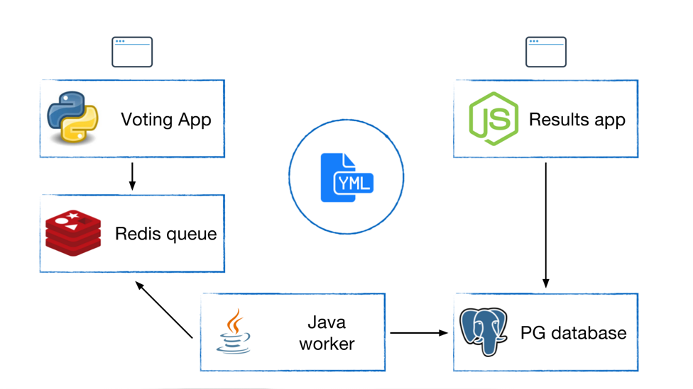

## Docker Compose 多容器部署

### <div id="class05-01">01、部署一个wordPress</div>
启动一个mysql 数据容器: `docker run -d --name=mysql -v mysql-data:/var/lib/mysql -e MYSQL_ROOT_PASSWORD=root -e MYSQL_DATABASE=wordpress mysql:5.6`

启动WordPress： `docker run -d -e WORDPRESS_DB_HOST=mysql:3306 --link mysql -p 8080:80 wordpress`

然后直接去宿主机访问 ip:8080 就可以了

然后依次安装就OK了                                              


### <div id="class05-02">02、Docker Compose 是什么</div>
一个应用需要多个容器， 统一管理容器就显得很痛苦， Docker Compose 就是做这个事儿的 。 

是一个基于Docker 的一个工具， 可以定义yml文件来定义多个容器。

默认文件名： docker-compose.yml

三个基本概念： Services 、Networks、 Volumes

#### Services
一个service代表一个container， 可以从dockerHub拉取， 也可以从本地image 创建。                         
service启动类似于 docker run , 可以指定network和volume， 也可以直接指定其应用。                   
例如：
```yaml
services:
    db:
      image: postgres: 9.4
      volumes: 
        - "db-data:/var/lib/postgresql/data"
      networks:
        - back-tier
```
上面这个实际上就是这样： `docker run -d --network back-tier -v db-data:/var/lib/postgresql/data postgres:9.4`

```yaml
servies: 
    worker:
      build: ./worker
      links:
        - db
        - redis
      networks:
        - back-tier
```

把第一节的 部署wordpress 用docker-compose 的方式部署， 就是这样子的
```yaml
version: '3'

services:

  wordpress:
    image: wordpress
    ports:
      - 8080:80
    environment:
      WORDPRESS_DB_HOST: mysql
      WORDPRESS_DB_PASSWORD: root
    networks:
      - my-bridge

  mysql:
    image: mysql:5.6
    environment:
      MYSQL_ROOT_PASSWORD: root
      MYSQL_DATABASE: wordpress
    volumes:
      - mysql-data:/var/lib/mysql
    networks:
      - my-bridge

volumes:
  mysql-data:

networks:
  my-bridge:
    driver: bridge
```


### <div id="class05-03">03、docker-compose的安装和基本使用</div>
安装详情可以参考这里: [https://docs.docker.com/compose/install/](https://docs.docker.com/compose/install/)

具体步骤：                       
1、 `sudo curl -L "https://github.com/docker/compose/releases/download/1.24.0/docker-compose-$(uname -s)-$(uname -m)" -o /usr/local/bin/docker-compose`                          
2、 `sudo chmod +x /usr/local/bin/docker-compose`                        

重要命令：                       

命令行 | 作用
:-|:-
`docker-compose up` | 默认启动docker-compose.yml 文件， 可以看到日志
`docker-compose -f docker-compose.yml up` | 启动指定的yml 配置文件
`docker-compose ps` | 查看启动的容器
`docker-compose stop` | 停止容器
`docker-compose start` | 启动容器
`docker-compose down` | stop and remove                     
`docker-compose up -d` | 后台执行， 不会看到日志                           
`docker-compose images` | 可以列出创建容器所需要的image                         
`dcoker-compose exec [service name] bash` | 进入指定容器的bash                         


### <div id="class05-04">04、水平扩展和均衡负载</div>
- [中级篇』Docker 水平扩展和负载均衡（40）](https://cloud.tencent.com/developer/article/1169149)

`docker-compose up --scale web=3 -d`


比如有一个这样的 docker-compose.yml 文件: 
```bash
version: "3"

services:

  redis:
    image: redis

  web:
    build:
      context: .
      dockerfile: Dockerfile
    environment:
      REDIS_HOST: redis

  lb:
    image: dockercloud/haproxy
    links:
      - web
    ports:
      - 8080:80
    volumes:
      - /var/run/docker.sock:/var/run/docker.sock 
```
web 服务都是链接到 redis 上面的，如果想启动多个web 服务器： `docker-compose up --scale web=3 -d`                                  

这个时候， 所有的web 服务都是均衡的链接到 redis 上面的。 


### <div id="class05-05">部署一个复杂应用</div>
                                    

直接把 code/chapter6/labs/example-voting-app/ 目录下面的内容拷贝到虚拟机上 `/home/vagrant/labs/`；                            
进入虚拟机之后 运行 `docker-compose up` 这个过程非常慢， 因为需要拉取基础镜像、生成源码 image；

如果有一些 docker-compose 里面定义的service 有些是需要dockerFile build 生成的， 就可以直接通过 `docker-compose build ` 直接生成就可以了。 
然后在执行`docker-compose up` 就可以了。 如果直接执行 `docker-compose build` 会直接先build 在 up.


说明 docker-compose 一般来说是用于本地开发的一个工具， 并不适合用于 生产环境
 


### 参考文章
- [中级篇』Docker 水平扩展和负载均衡（40）](https://cloud.tencent.com/developer/article/1169149)
- [docker-compose 部署一个复杂应用](https://blog.csdn.net/u011781521/article/details/80464826)
- [Docker学习实践](https://www.cnblogs.com/wj5633/p/6680771.html)
- [使用Docker-compose编排容器](https://www.cnblogs.com/wj5633/p/6707012.html)


