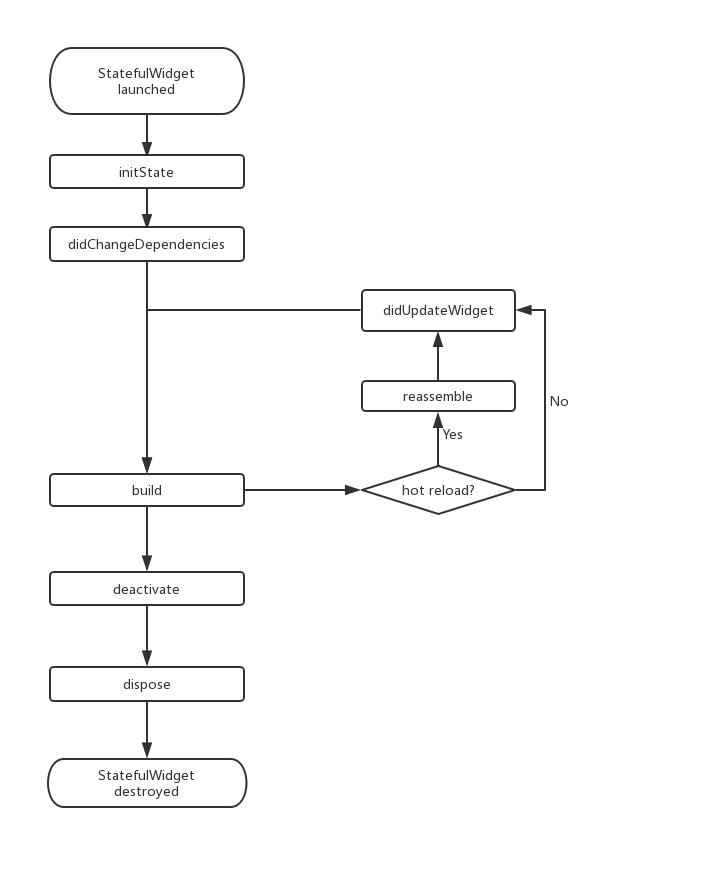

## 第一个 flutter 应用

### 官方 demo 实例
可以参考这里: [demo](/books/专题知识库/20、flutter/01、flutter从零到实战/03、HelloWorld/readme.md)


### widget 简介

#### StatelessWidget
申明可以使用快捷键 `stless`

StatelessWidget用于不需要维护状态的场景

context:                                
```dart
class YLContextRoute extends StatelessWidget {
  const YLContextRoute({Key? key}) : super(key: key);

  @override
  Widget build(BuildContext context) {
    return Scaffold(
      appBar: AppBar(title: const Text("Context 测试")),
      body: Builder(builder: (context) {
        // 在 widget 树中向上查找最近的父级`Scaffold`  widget
        Scaffold scaffold = context.findAncestorWidgetOfExactType() as Scaffold;
        // 直接返回 AppBar的title， 此处实际上是Text("Context测试")
        return (scaffold.appBar as AppBar).title as Widget;
      }),
    );
  }
}
```


#### StatefulWidget
申明可以使用快捷键： `stful`                      
```dart
class CounterWidget extends StatefulWidget {
  const CounterWidget({Key? key, this.initValue = 0});

  final int initValue;

  @override
  _CounterWidgetState createState() => _CounterWidgetState();
}
```

**State**                       
一个 StatefulWidget 类会对应一个 State 类，State表示与其对应的 StatefulWidget 要维护的状态；

State 中的保存的状态信息可以：                  
- 生命周期信息
- 构建时可以被同步读取

State 中有两个常用属性：                 
- widget，它表示与该 State 实例关联的 widget 实例，由Flutter 框架动态设置。
- context。StatefulWidget对应的 BuildContext，作用同StatelessWidget 的BuildContext。

**State 生命周期**
```dart
class CounterWidget extends StatefulWidget {
  const CounterWidget({Key? key, this.initValue = 0});

  final int initValue;

  @override
  _CounterWidgetState createState() => _CounterWidgetState();
}

class _CounterWidgetState extends State<CounterWidget> {
  int _counter = 0;

  @override
  void initState() {
    super.initState();
    //初始化状态
    _counter = widget.initValue;
    print("initState");
  }

  @override
  Widget build(BuildContext context) {
    print("build");
    return Scaffold(
      body: Center(
        child: TextButton(
          child: Text('$_counter'),
          //点击后计数器自增
          onPressed: () => setState(
                () => ++_counter,
          ),
        ),
      ),
    );
  }

  @override
  void didUpdateWidget(CounterWidget oldWidget) {
    super.didUpdateWidget(oldWidget);
    print("didUpdateWidget ");
  }

  @override
  void deactivate() {
    super.deactivate();
    print("deactivate");
  }

  @override
  void dispose() {
    super.dispose();
    print("dispose");
  }

  @override
  void reassemble() {
    super.reassemble();
    print("reassemble");
  }

  @override
  void didChangeDependencies() {
    super.didChangeDependencies();
    print("didChangeDependencies");
  }
}
```
生命周期图可以看这个：                     


可以参考文档： https://book.flutterchina.club/chapter2/flutter_widget_intro.html#_2-2-6-state


#### 在 StatefulWidget 树中获取 State 对象
主要办法有两个： context、GlobalKey       

总结一下：
```
方式1：
ScaffoldState _state = context.findAncestorStateOfType<ScaffoldState>()!;
_state.openDrawer();

方式2:
ScaffoldState state = Scaffold.of(context);
state.openDrawer();

方式3：
ScaffoldMessenger.of(context).showSnackBar(
  const SnackBar(content: Text("我是 snack bar"))
);

方式4：
// todo ...
static final GlobalKey<ScaffoldState> _globalKey = GlobalKey();
// todo ...

return Scaffold(
  key: _globalKey,
  //....
);

// todo ...
onPressed: () => _globalKey.currentState?.openDrawer(),
```

具体实例如下：
```dart
import 'package:flutter/material.dart';

class YLGetStateObjectRoute extends StatefulWidget {
  const YLGetStateObjectRoute({Key? key}) : super(key: key);

  @override
  State<YLGetStateObjectRoute> createState() => _YLGetStateObjectRouteState();
}

/// 在 Flutter 开发中便有了一个默认的约定：
///   如果 StatefulWidget 的状态是希望暴露出的，应当在 StatefulWidget 中提供一个of 静态方法来获取其 State 对象，
///   开发者便可直接通过该方法来获取；
///   如果 State不希望暴露，则不提供of方法。
///
/// 疑问： 如何界定 state 是否希望对外暴露？
class _YLGetStateObjectRouteState extends State<YLGetStateObjectRoute> {
  static final GlobalKey<ScaffoldState> _globalKey = GlobalKey();

  @override
  Widget build(BuildContext context) {
    return Scaffold(
      key: _globalKey,
      appBar: AppBar(title: const Text("子树中获取State对象")),
      body: Center(
        child: Column(
          children: [
            Builder(builder: (context) {
              return ElevatedButton(
                onPressed: () {
                  ScaffoldState _state =
                      context.findAncestorStateOfType<ScaffoldState>()!;
                  _state.openDrawer();
                },
                child: const Text("打开抽屉菜单1"),
              );
            }),
            Builder(builder: (context) {
              return ElevatedButton(
                onPressed: () {
                  ScaffoldState state = Scaffold.of(context);
                  state.openDrawer();
                },
                child: const Text("打开抽屉菜单2"),
              );
            }),
            Builder(builder: (context) {
              return ElevatedButton(
                onPressed: () {
                  ScaffoldMessenger.of(context).showSnackBar(
                      const SnackBar(content: Text("我是 snack bar")));
                },
                child: const Text("显示 snack bar"),
              );
            }),
            ElevatedButton(
                onPressed: () => _globalKey.currentState?.openDrawer(),
                child: const Text("打开抽屉菜单4"))
          ],
        ),
      ),
      drawer: const Drawer(),
    );
  }
}
```

#### 通过 RenderObject 自定义 Widget
StatelessWidget 和 StatefulWidget 都是用于组合其它组件的，它们本身没有对应的 RenderObject。

Flutter 组件库中的很多基础组件都不是通过StatelessWidget 和 StatefulWidget 来实现的，
比如 Text 、Column、Align等，
就好比搭积木，StatelessWidget 和 StatefulWidget 可以将积木搭成不同的样子，
但前提是得有积木，而这些积木都是通过自定义 RenderObject 来实现的。

示例：
```dart
class CustomWidget extends LeafRenderObjectWidget{
  @override
  RenderObject createRenderObject(BuildContext context) {
    // 创建 RenderObject
    return RenderCustomObject();
  }
  @override
  void updateRenderObject(BuildContext context, RenderCustomObject  renderObject) {
    // 更新 RenderObject
    super.updateRenderObject(context, renderObject);
  }
}

class RenderCustomObject extends RenderBox{

  @override
  void performLayout() {
    // 实现布局逻辑
  }

  @override
  void paint(PaintingContext context, Offset offset) {
    // 实现绘制
  }
}
```


